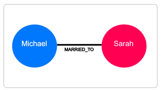
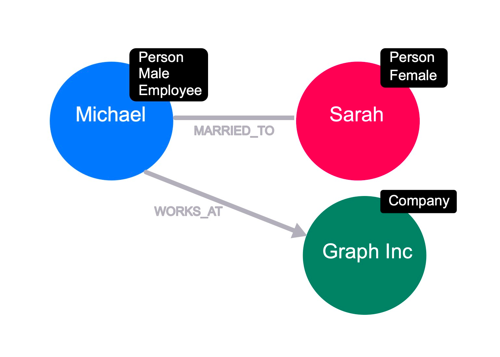
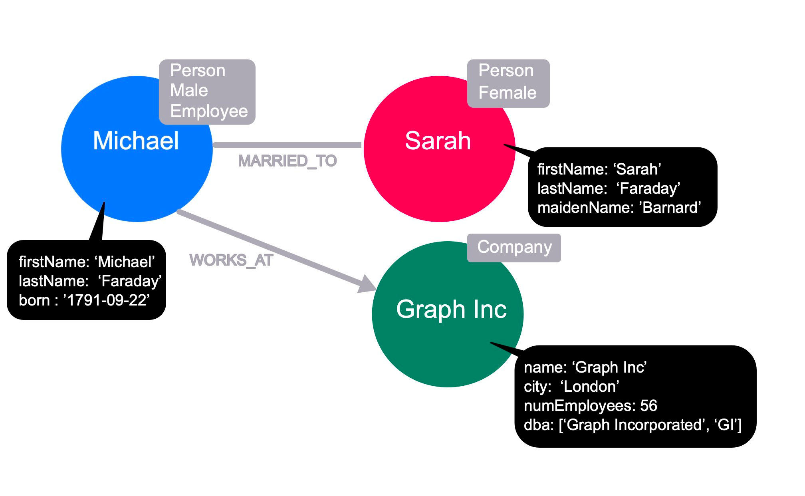
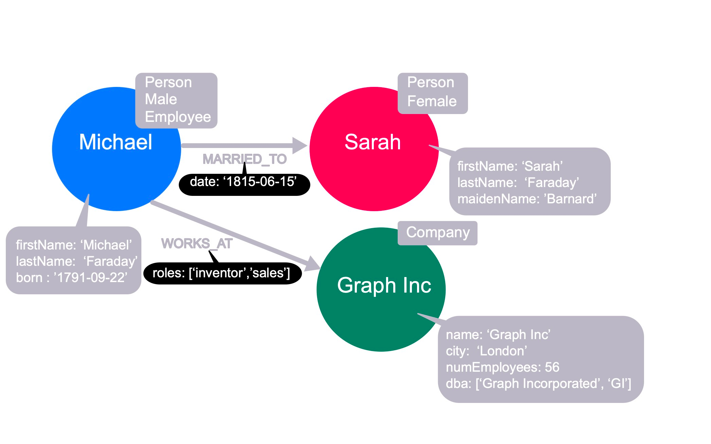

# Neo4J Fundamentals
## Nodes and Edges

- Nodes (also known as vertices)
- Relationships (also known as edges)

Nodes (or vertices) are the circles in a graph. Nodes commonly represent objects, entities, or merely things. Examples of entities that could typically be represented as a node are: person, product, event, book or subway station.


## Directed vs. undirected graphs
In an undirected graph, relationships are considered to be bi-directional or symmetric.



A directed graph adds an additional dimension of information to the graph. Directional relationships can often be qualified with some sort of weighting. 


## Weighted vs. unweighted graphs

In a weighted graph, the relationships between nodes carry a value that represents a variety of measures, for example cost, time, distance or priority. Traversal implies that the relationships are followed in the graph.

#### Usage
1. Real-time recommendations
2. Investigative Journalism
3. Network and IT operations
4. Transportation and logistics

## Propertry Graph
Neo4J has additional elements which make a knowledge graph a *property graph*

### 1. Labels
Through nodes we are signifying that the node belongs to a subset of nodes within the graph.



### 2. Node Properties

Properties are key, value pairs and can be added or removed from a node as necessary.




## In short
- **Labels:** Categorize nodes, grouping them by type (e.g., :Person, :Movie).
- **Node Properties:** Key-value pairs that store data within nodes (e.g., name: 'Alice', age: 30).

## Relationship direction
- In Neo4j, each relationship must have a direction in the graph. 
- A relationship is created between a source node and a destination node

## Relationship type
- Each relationship in a neo4j graph must have a type. 

## Relationship properties
As with nodes, relationships can also have properties



```
- Type and direction are must in relationships
- Property and weight are optional in relationships
```

## Index-free adjacency
- Neo4J has Index-free adjacency enables graph traversals are faster and more efficient
- Index-free adjacency is a huge differentiator between relational and graph databases.

```
The joins made in a relational database are computed at read-time.
The query time in a graph database will remain consistent to the size of the data that is actually touched during a query.
```

## NoSQL Databases
The two most common NoSQL databases represent key/value stores and documents.

The key-value model is great and highly performant for lookups of huge amounts of simple or even complex values.

The structured hierarchy of a Document model accommodates a lot of schema-free data that can easily be represented as a tree.

# Explore Neo4J
```
MATCH (m:Movie) RETURN m
```
- `MATCH (m:Movie):` This finds all nodes in the graph that have the label Movie and assigns them the alias m.
- `RETURN m:` This returns the nodes (or the data within the nodes) found in the previous step.

```
    CALL db.labels()
```
This query will return a list of all node labels present in the database. 


## Services
AuraDB is a fully managed cloud service that provides a Neo4j database as a service.

