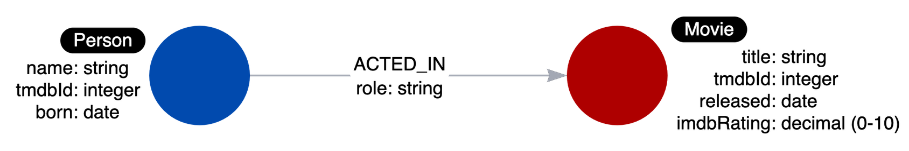

# Graph Data Modeling

The graph should:
1. Answer the key use cases for the application.
2. Provide the best Cypher statement performance for the key use cases.

## Components of a Neo4j graph
The Neo4j components that are used to define the graph data model are:

1. Nodes
2. Labels
3. Relationships
4. Properties

Graph data modeling is an iterative process. Refactoring is very common in the development process. A Neo4j graph has an optional schema which is quite flexible, unlike the schema in an RDBMS. A Cypher developer can easily modify the graph to represent an improved data model.

## Types of models
When performing the graph data modeling process for an application, you will need at least two types of models:
- Data model
- Instance model

### Data Model
The data model describes the labels, relationships, and properties for the graph. It does not have specific data that will be created in the graph.

A graph data model, however is important because it defines the names that will be used for labels, relationship types, and properties when the graph is created and used by the application.

A data model refers to the structure or blueprint defining how data is organized, including node labels, relationships, and properties.
An instance model is the actual data stored, representing specific nodes, relationships, and their values.

### Naming Convention

A label is a single identifier that begins with a capital letter and can be CamelCase.

A relationship type is a single identifier that is in all capital letters with the underscore character.

A property key for a node or a relationship is a single identifier that begins with a lower-case letter and can be camelCase.

# Modeling Nodes
## Defining labels
Entities are the dominant nouns in your application use cases:

- What **ingredients** are used in a **recipe** ?
- Who is married to this **person**?

The entities of your use cases will be the labeled nodes in the graph data model.

## Node properties
Node properties are used to:

- Uniquely identify a node.
- Answer specific details of the use cases for the application.
- Return data.

