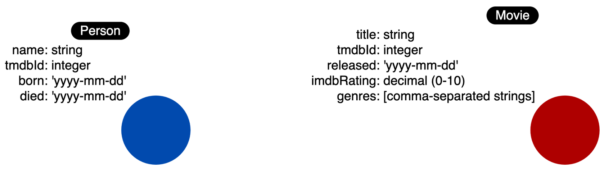
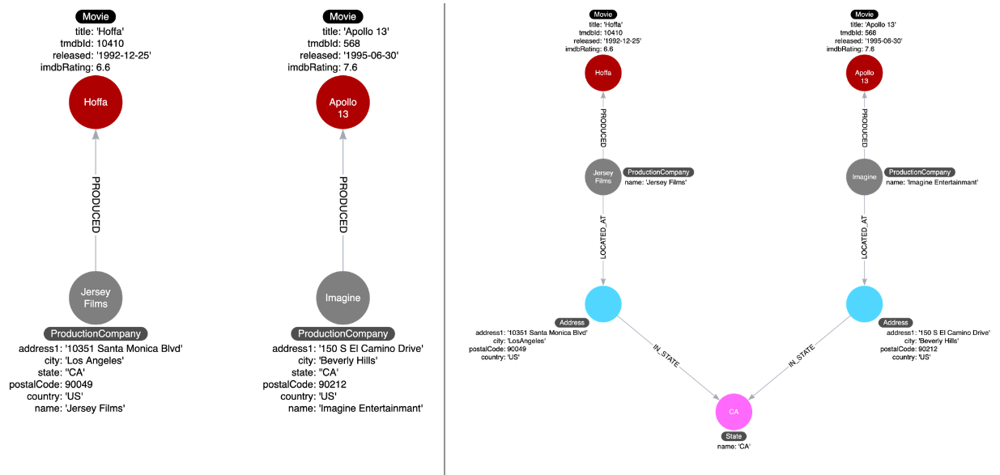

# Graph Data Modeling

The graph should:
1. Answer the key use cases for the application.
2. Provide the best Cypher statement performance for the key use cases.

## Components of a Neo4j graph
The Neo4j components that are used to define the graph data model are:

1. Nodes
2. Labels
3. Relationships
4. Properties

Graph data modeling is an iterative process. Refactoring is very common in the development process. A Neo4j graph has an optional schema which is quite flexible, unlike the schema in an RDBMS. A Cypher developer can easily modify the graph to represent an improved data model.

## Types of models
When performing the graph data modeling process for an application, you will need at least two types of models:
- Data model
- Instance model

### Data Model
The data model describes the labels, relationships, and properties for the graph. It does not have specific data that will be created in the graph.


A graph data model, however is important because it defines the names that will be used for labels, relationship types, and properties when the graph is created and used by the application.

A data model refers to the structure or blueprint defining how data is organized, including node labels, relationships, and properties.
An instance model is the actual data stored, representing specific nodes, relationships, and their values.

### Naming Convention

A label is a single identifier that begins with a capital letter and can be CamelCase.

A relationship type is a single identifier that is in all capital letters with the underscore character.

A property key for a node or a relationship is a single identifier that begins with a lower-case letter and can be camelCase.

# Modeling Nodes
## Defining labels
Entities are the dominant nouns in your application use cases:

- What **ingredients** are used in a **recipe** ?
- Who is married to this **person**?

The entities of your use cases will be the labeled nodes in the graph data model.

## Node properties
Node properties are used to:

- Uniquely identify a node.
- Answer specific details of the use cases for the application.
- Return data.



# Modeling Relationships
Connections are the verbs in your use cases:

- What ingredients are used in a recipe?
- Who is married to this person?

 Their micro- and macro-design are arguably the most critical factors in graph performance


## Properties for relationships
Properties for a relationship are used to enrich how two nodes are related. When you define a property for a relationship.


# Testing

A really important factor with testing the graph is scalability. How will these queries perform if the graph has millions of nodes or relationships?

# Refactoring
updating data does not mean refactoring 


# Labels in a graph
Node labels serve as an anchor point for a query. By specifying a label, we are specifying a subset of one or more nodes with which to start a query. 

Your goal in modeling should be to reduce the size of the graph that is touched by a query.


You should use labels wisely in your data model. They should be used if it will help with **most** of your use cases. Again if the use of a property for a node will suffice, then it is best to not have the label. You can use the PROFILE keyword to see the performance for a query. When the number of labels stored against a node exceeds 4, the data is stored in different way which may prove to be slower to access at runtime.


## Duplicate Data


Here we see that all Movie nodes have English in the list of languages. This is duplicate data and for a scaled database, would represent a lot of duplication.

#### Solution

1. We take the property values for each Movie node and create a Language node.
2. Then we create the IN_LANGUAGE relationship between that Movie node and the Language node.
3. Finally, we remove the languages property from the Movie node.

we use `UNWIND` to seperate the list of elements




## Specialized Relationships
It is more performant to traverse the graph based on query types rather than properties in the nodes.

Relationships are fast to traverse and they do not take up a lot of space in the graph. Specialized Relationships help query performance.

```
MATCH (p.Actor)-[:ACTED_IN]-(m:Movie)
WHERE p.name = 'Tom Hanks' AND
m.released STARTS WITH '1995'
RETURN m.title as Movie
```
If tom hanks acted in 1000 movies, this query would need to retreive all movies in which tom hanks acted in and check values.
we can add additional relationships


# Intermediate nodes

In Neo4j, relationships only connect two nodes. If you need to represent a relationship that involves more than two nodes (like a "hyperedge" in math), Neo4j can't do this directly. Instead, you create an extra node to act as a "bridge" between those multiple nodes, allowing you to capture all the information you need.


You create intermediate nodes when you need to:

- Connect more than two nodes in a single context.
    - Hyperedges (n-ary relationships)
- Relate something to a relationship.
- Share data in the graph between entities.


