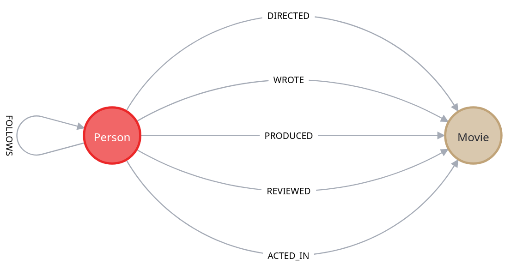
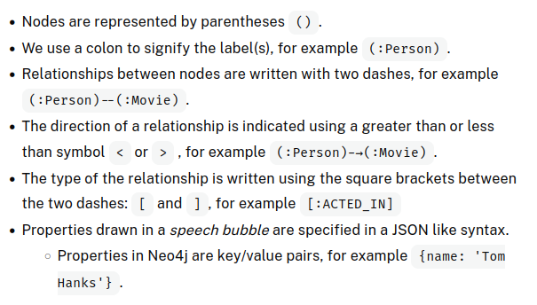

Data model used for the course



Cypher is a query language designed for graphs.



We retrieve data from the graph using the MATCH keyword. You can think of the MATCH clause as similar to the FROM clause in an SQL statement.

Suppose we want to retrieve all Person nodes from the graph. We can assign a variable by placing a value before the colon. Let’s use the variable p. Now that p represents all Person nodes retrieved from the graph, we can return them using the RETURN clause.

```GraphQL
MATCH (p:Person)
RETURN p
```

We can use the braces {..} to specify the key/value pair of name and Tom Hanks as the filter. This query returns the value of the born property of the Tom Hanks node.

```Cypher
MATCH (p:Person {name: 'Tom Hanks'})
RETURN  p.born

<!-- Alternatively -->
MATCH (p:Person)
WHERE p.name = 'Tom Hanks'
RETURN p.born
```

#### Question
When was Kevin Bacon born? Find the year that was born. This value is stored in the property.

```
MATCH (p.person)
WHERE p.name = 'Kevin Bacon'
RETURN p.born

<!-- OR -->

MATCH (p.person {p.name = 'Kevin Bacon'})
RETURN p.born
```

## Finding Relationships

```Cyper

``

This part of the query searches for a node labeled Person with a property name equal to 'Tom Hanks'.
It then matches any outgoing relationship `[:ACTED_IN]` from the Person node to a connected Movie node m.

## 