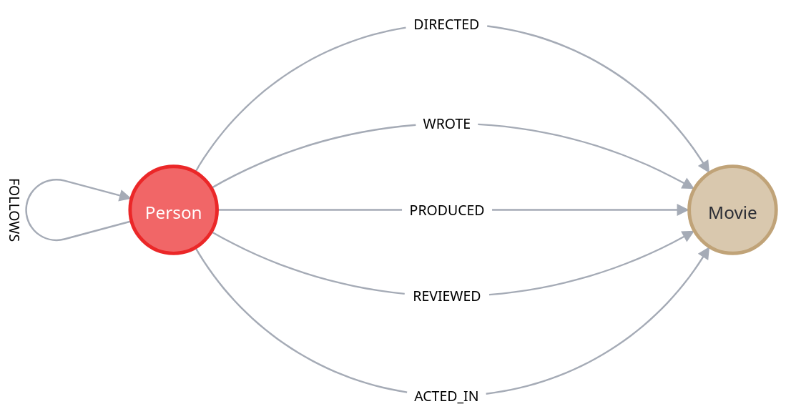
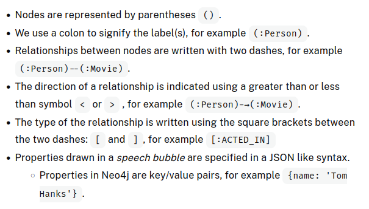

Data model used for the course



Cypher is a query language designed for graphs.



We retrieve data from the graph using the MATCH keyword. You can think of the MATCH clause as similar to the FROM clause in an SQL statement.

Suppose we want to retrieve all Person nodes from the graph. We can assign a variable by placing a value before the colon. Let’s use the variable p. Now that p represents all Person nodes retrieved from the graph, we can return them using the RETURN clause.

```GraphQL
MATCH (p:Person)
RETURN p
```

We can use the braces {..} to specify the key/value pair of name and Tom Hanks as the filter. This query returns the value of the born property of the Tom Hanks node.

```Cypher
MATCH (p:Person {name: 'Tom Hanks'})
RETURN  p.born

<!-- Alternatively -->
MATCH (p:Person)
WHERE p.name = 'Tom Hanks'
RETURN p.born
```

#### Question
When was Kevin Bacon born? Find the year that was born. This value is stored in the property.

```
MATCH (p.person)
WHERE p.name = 'Kevin Bacon'
RETURN p.born

<!-- OR -->

MATCH (p.person {p.name = 'Kevin Bacon'})
RETURN p.born
```

## Finding Relationships

```
MATCH (p:Person {name: 'Tom Hanks'})-[:ACTED_IN]->(m:Movie)
RETURN m.title

<!-- OR -->
MATCH (p:Person)-[:ACTED_IN]->(m:Movie)
WHERE p.name = 'Tom Hanks'
RETURN m.title
```

This part of the query searches for a node labeled Person with a property name equal to 'Tom Hanks'.
It then matches any outgoing relationship `[:ACTED_IN]` from the Person node to a connected Movie node m.

## Filtering

#### 1. Basic Filtering with WHERE Clause:

The `WHERE` clause is used to filter nodes and relationships. You can filter based on property equality, logical expressions, and more complex conditions. Example: Find people who acted in movies released in 2008 or 2009.

```
MATCH (p:Person)-[:ACTED_IN]->(m:Movie)
WHERE m.released = 2008 OR m.released = 2009
RETURN p, m
```
#### 2. Filtering by Node Labels:
You can filter by node labels either by specifying the labels in the MATCH clause or by testing them in the WHERE clause.
    Example: Find actors in the movie "The Matrix".

```
MATCH (p)-[:ACTED_IN]->(m)
WHERE p:Person AND m:Movie AND m.title='The Matrix'
RETURN p.name
```
#### 3. Range Filtering:
Filter nodes based on property ranges. Example: Retrieve actors in movies released between 2000 and 2003.

```
MATCH (p:Person)-[:ACTED_IN]->(m:Movie)
WHERE 2000 <= m.released <= 2003
RETURN p.name, m.title, m.released
```
#### 4. Filtering by Property Existence:
Use `IS NOT NULL` to filter nodes or relationships that contain a specific property. Example: Retrieve movies where Jack Nicholson acted and the movie has a tagline.

```
MATCH (p:Person)-[:ACTED_IN]->(m:Movie)
WHERE p.name='Jack Nicholson' AND m.tagline IS NOT NULL
RETURN m.title, m.tagline
```
#### 5. String Filtering:
Use string functions like `STARTS WITH`, `ENDS WITH`, and `CONTAINS` to filter by partial strings.
Example: Find actors whose name starts with "Michael".

```
MATCH (p:Person)-[:ACTED_IN]->()
WHERE p.name STARTS WITH 'Michael'
RETURN p.name
```
#### 6. Filtering by Graph Patterns:
Use pattern matching to filter based on graph structures.
Example: Find people who wrote a movie but did not direct it.

```
MATCH (p:Person)-[:WROTE]->(m:Movie)
WHERE NOT exists((p)-[:DIRECTED]->(m))
RETURN p.name, m.title
```
#### 7. Filtering Using Lists:
- Use lists in WHERE clauses to test against multiple values.
- Example: Find people born in specific years.
```
MATCH (p:Person)
WHERE p.born IN [1965, 1970, 1975]
RETURN p.name, p.born
```
#### 8. Using `IN` with Lists:

- You can also check if a value exists in a list property.
- Example: Find the actor who played Neo in "The Matrix".

```
MATCH (p:Person)-[r:ACTED_IN]->(m:Movie)
WHERE 'Neo' IN r.roles AND m.title='The Matrix'
RETURN p.name, r.roles
```
#### 9. Finding Properties of Nodes and Relationships:

- Use the keys() function to discover the properties of nodes.
- Example: Retrieve all property keys for Person nodes.

```
MATCH (p:Person)
RETURN p.name, keys(p)
```
#### 10. Querying All Property Keys in the Graph:

You can retrieve all property keys defined in the graph.

```
CALL db.propertyKeys()
```

# Writing Data to the Graph

`MERGE` command allows for creating nodes and relationships. It finds the node if it exists and creates if it doesnt.

```
MERGE (p:Person {name: 'Michael Caine'})
```
The label of the node is Person, and the node has a property name with the value 'Michael Caine'.

Checking if the node was created
```
MATCH (p:Person {name: 'Michael Caine'})
RETURN p
```

Assigning multiple nodes
```
MERGE (p:Person:Actor {name: 'Michael Caine'})
```

## Create command
- `CREATE:` Always creates new nodes or relationships without checking if they already exist. 
- `MERGE:` Ensures that nodes or relationships only get created if they do not already exist.

#### Question
Use the sandbox window to the right to create a new Person node for the rising star `Daniel Kaluuya`.
```
MERGE (p:Person {name:'Daniel Kaluuya'})
```

## Creating Relationships
Just like you can use MERGE to create nodes in the graph, you use MERGE to create relationships between two nodes. First you must have references to the two nodes you will be creating the relationship for. 

```
MATCH (p:Person {name: 'Michael Caine'})
MATCH (m:Movie {title: 'The Dark Knight'})
MERGE (p)-[:ACTED_IN]->(m)

<!-- To Check -->

MATCH (p:Person {name: 'Michael Caine'})-[:ACTED_IN]-(m:Movie {title: 'The Dark Knight'})
RETURN p, m
```
We can also create an undirected relationship. In this case, it doesn't matter whether the relationship goes from a to b or from b to a. It will create one if none exists, but it will not care about the direction.
```
MERGE (a)-[:LIKES]-(b)
```
This creates an undirected relationship, meaning either a likes b or b likes a.
Notice also that you need not specify direction in the MATCH pattern since the query engine will look for all nodes that are connected, regardless of the direction of the relationship.

#### Question
Use the sandbox window to the right to add a new node and relationship to the graph:
- Find the Person node for 
- Create the Movie node,
- Add the relationship between Daniel Kaluuya and the movie, Get Out.

```
MERGE (p:Person {name: 'Daniel Kaluuya'})
MERGE (m:Movie {title: 'Get Out'})
MERGE (p)-[:ACTED_IN]->(m)
RETURN p, m
```

## Updating properties

Thus far, you have learned how to create nodes with MERGE where you specify the primary key property for the node. You can add, modify, or remove properties from nodes and relationships.

You can also set a property for a relationship inline as follows:
```
MATCH (p:Person {name: 'Michael Caine'})
MERGE (m:Movie {title: 'Batman Begins'})
MERGE (p)-[:ACTED_IN {roles: ['Alfred Penny']}]->(m)
RETURN p, m

<!-- OR -->

MATCH (p:Person)-[r:ACTED_IN]->(m:Movie)
WHERE p.name = 'Michael Caine' AND m.title = 'The Dark Knight'
SET r.roles = ['Alfred Penny']
RETURN p, r, m
```

## Setting multiple properties
```
MATCH (p:Person)-[r:ACTED_IN]->(m:Movie)
WHERE p.name = 'Michael Caine' AND m.title = 'The Dark Knight'
SET r.roles = ['Alfred Penny'], m.released = 2008
RETURN p, r, m
```
`SET` can also be used to update properties

## Removing properties

You can remove or delete a property from a node or relationship by using the `REMOVE` keyword, or setting the property to `null`.

```
MATCH (p:Person)-[r:ACTED_IN]->(m:Movie)
WHERE p.name = 'Michael Caine' AND m.title = 'The Dark Knight'
REMOVE r.roles
RETURN p, r, m

<!--  -->

MATCH (p:Person)
WHERE p.name = 'Gene Hackman'
SET p.born = null
RETURN p
```

### Modifying Merge

You can also customize `MERGE` with these options:
- ON CREATE SET: Used to set properties only when a node is newly created.
- ON MATCH SET: Used to set properties only when an existing node is found.
- SET: Can be used to set properties regardless of whether the node was found or created.

### Node Deletion
We can delete:
1. nodes
2. relationships
3. properties
4. labels.

#### Deleting a node
```
MATCH (p:Person {name: 'Jane Doe'})
DELETE p
```

#### Deleting a relationship
```
MATCH (p:Person {name: 'Jane Doe'})-[r:ACTED_IN]->(m:Movie {title: 'The Matrix'})
DELETE r
```

#### Deleting a Node with Relationships:
You can't delete a node with relationships unless you remove the relationships first.
To delete both the node and its relationships:

```
MATCH (p:Person {name: 'Jane Doe'})
DETACH DELETE p
```

#### Deleting All nodes and relationships
```
MATCH (n)
DETACH DELETE n
```

#### Managing Labels:
Adding a label

```
MATCH (p:Person {name: 'Jane Doe'})
SET p:Developer
```
Removing a label

    MATCH (p:Person {name: 'Jane Doe'})
    REMOVE p:Developer

Listing All Labels in the Graph:
```
CALL db.labels()
```