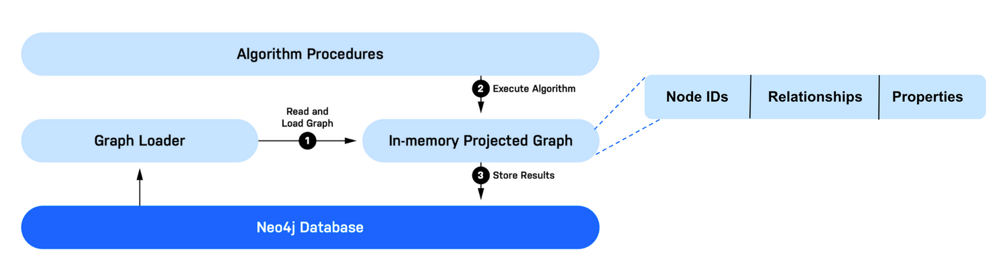

# Introduction

GDS is delivered as library and a plugin to the Neo4j Graph Database. GDS also comes in both a free Community and paid Enterprise license which have important differences in regard to performance and enterprise capabilities. However, all analytics functionality, including graph algorithms and machine learning methods, are the same between both licenses.

At a high-level, GDS works by transforming and loading data into an in-memory format that is optimized for high-performance graph analytics. GDS provides graph algorithms, feature engineering, and machine learning methods to execute on this in-memory graph format. 

1. Read and Load the Graph:

    - GDS reads data from the Neo4j database, transforms it, and loads it into an in-memory graph.
    - This process is called projecting a graph, and the in-memory graph is known as a graph projection.
    - Multiple graph projections can be held simultaneously and are managed by the Graph Catalog.

2. Execute Algorithms:
    - GDS supports various graph algorithms like centrality, community detection, and pathfinding.
    - It also includes advanced techniques like embeddings for graph feature engineering and machine learning pipelines.

3. Store Results:
    - After running algorithms, GDS allows you to write results back to the database, export them as CSV files, or stream them into other applications or workflows.